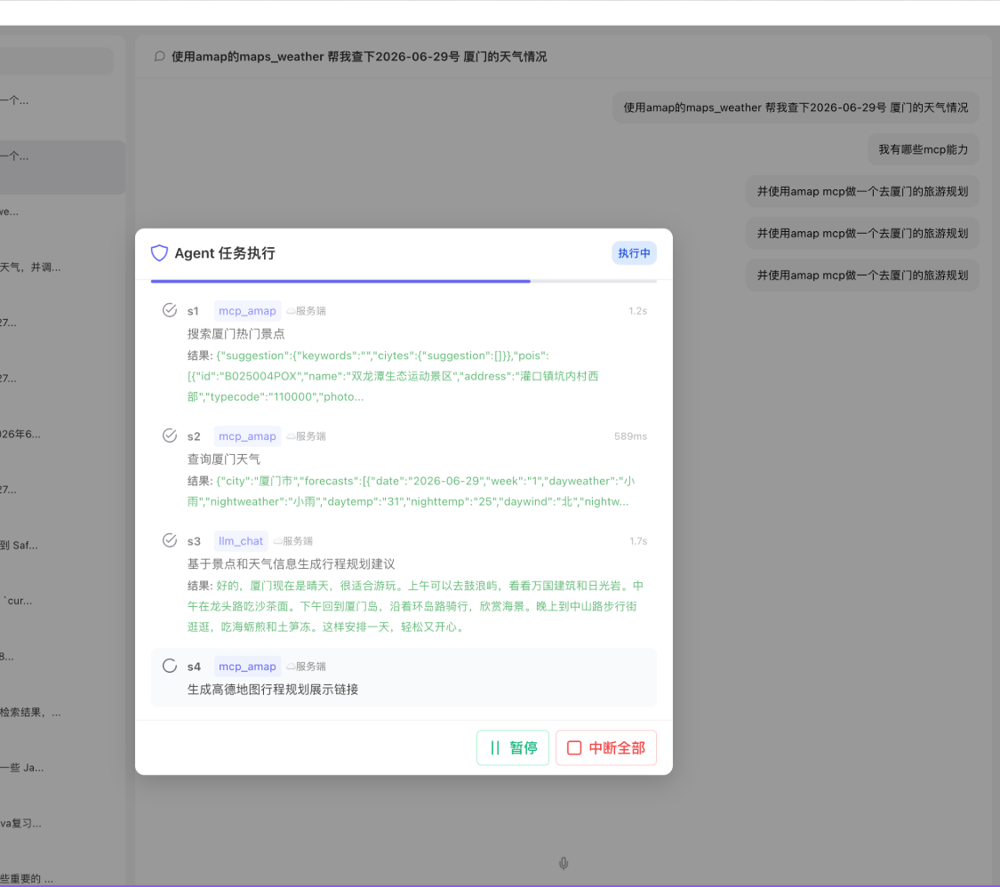
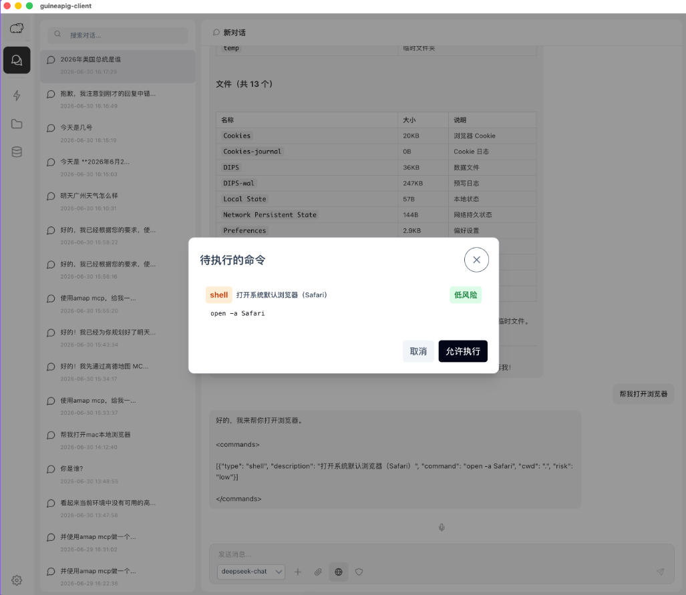

<p align="center">
  
</p>

<h1 align="center">🐹 GuineaPig All-in-One</h1>

<p align="center">
  <strong>AI 语音对话助手 · 全栈开源平台</strong>
</p>

<p align="center">
  
  
  
  
  
</p>

---

## 📋 目录

- [项目介绍](#-项目介绍)
- [效果展示](#-效果展示)
- [技术架构](#-技术架构)
- [核心能力](#-核心能力)
- [快速开始](#-快速开始)
- [开发指南](#-开发指南)
- [部署指南](#-部署指南)
- [项目结构](#-项目结构)
- [技术栈](#-技术栈)

---

## 🎯 项目介绍

**GuineaPig** 是一个以**语音交互为核心**的 AI 桌面助手平台，整合了 LLM（大语言模型）、ASR（语音识别）和 TTS（语音合成）能力，让用户通过最自然的语音方式与 AI 完成对话和任务。

### 谁适合使用 GuineaPig？

| 角色 | 使用场景 |
|------|---------|
| **普通用户** | 通过桌面客户端进行语音对话、语音搜索、AI 助理任务 |
| **运维人员** | 通过运营管理后台（ops-web）管理用户、监控系统 |
| **开发者** | 集成 AI Agent、扩展自定义 Skill、部署到 Kubernetes |
| **团队** | 多用户语音对话系统，支持 IM Bot 集成 |

---

## 📸 效果展示

<div align="center">
  <table>
    <tr>
      <td width="50%" align="center">
        
        <br><em>桌面客户端 - Agent模式</em>
      </td>
      <td width="50%" align="center">
        
        <br><em>桌面客户端 - 普通模式</em>
      </td>
    </tr>
  </table>

  <p>更多界面截图请查看 <a href="other/"><code>other/</code></a> 目录。</p>
</div>

---

## 🏗 技术架构

```
┌──────────────────────────────────────────────────────┐
│              Presentation Layer (Layer 4)             │
│  ┌─────────────────────┐  ┌────────────────────────┐  │
│  │  guineapig-client   │  │   guineapig-ops-web    │  │
│  │  (Electron + Vue 3) │  │  (Vue 3 + Element Plus)│  │
│  │  桌面语音客户端      │  │  运营管理后台           │  │
│  └─────────┬───────────┘  └──────────┬─────────────┘  │
│            │       HTTP/WebSocket     │                │
├────────────┼──────────────────────────┼───────────────┤
│            ▼                          ▼               │
│              Business Logic (Layer 3)                  │
│  ┌─────────────────────────────────────────────────┐  │
│  │           guineapig-backend (Go)                │  │
│  │  Echo v4 · GORM · Redis · Asynq · Zap          │  │
│  │  业务编排 · 用户管理 · 对话管理 · 任务调度       │  │
│  └─────────────────────┬───────────────────────────┘  │
│                        │  HTTP / gRPC                  │
├────────────────────────┼──────────────────────────────┤
│                        ▼                               │
│               AI Capability (Layer 2)                  │
│  ┌─────────────────────────────────────────────────┐  │
│  │         guineapig-aiagent (FastAPI)             │  │
│  │  ASR (SenseVoice) · LLM (DeepSeek) · TTS        │  │
│  │  AI Agent · MCP · RAG · Skill System            │  │
│  └──────────┬──────────┬──────────┬────────────────┘  │
│             │          │          │                    │
├─────────────┼──────────┼──────────┼──────────────────┤
│             ▼          ▼          ▼                   │
│           Infrastructure (Layer 1)                     │
│  ┌──────────┐ ┌──────────┐ ┌──────────┐              │
│  │  MySQL   │ │  Redis   │ │ MinIO/S3 │              │
│  │ 业务数据  │ │ 会话缓存  │ │  音频存储 │              │
│  └──────────┘ └──────────┘ └──────────┘              │
└──────────────────────────────────────────────────────┘
```

### 数据流

```
用户语音 → ASR(语音转文字) → LLM(语义理解+推理) → TTS(文字转语音) → 语音播放
                    ↓                ↓                        ↓
                  S3存储          Agent执行                  S3存储
                                (MCP工具调用)
```

### 依赖规则

- **Layer 4 → Layer 3**: 仅通过 HTTP REST / WebSocket 通信 (client → backend)
- **Layer 3 → Layer 2**: 仅通过 HTTP 调用 AI 能力 (backend → aiagent)
- **Layer 2 → Layer 1**: 直接访问 S3 (音频) 和 Redis (上下文)
- **Layer 3 → Layer 1**: 直接访问 MySQL (业务数据) 和 Redis (会话)
- **禁止**: 前端直接调用 AI、后端直接调用 AI 模型、跨包导入

---

## ✨ 核心能力

### 🎤 语音对话
- 完整的 ASR → LLM → TTS 语音对话管线
- 语音输入、AI 语音回复、对话历史管理
- 基于 S3 的音频文件中转存储

### 🤖 AI Agent 系统
- **意图分类**: QuickFilter → IntentScanner → DeepAnalyzer 三级流水线
- **DAG 执行引擎**: 支持多步骤复杂任务编排
- **MCP 能力集成**: 工具调用、Skill 管理、文件操作
- **SSE 流式响应**: 实时对话体验
- **对话上下文管理**: 15 天滚动窗口记忆摘要

### 📊 运营管理后台 (ops-web)
- 用户管理（注册/登录/权限）
- Bot 配置管理
- 系统监控与指标可视化 (ECharts)
- 对话记录查询

### 🧩 Skill 能力系统
- 自定义 Skill 上传与注册
- SKILL.md 元数据规范
- S3 分发 + 自动解压部署

### 🔧 其他能力
- **IM Bot 集成**: 消息分发、自动回复
- **RAG 检索增强**: Milvus 向量数据库
- **OpenTelemetry 指标**: Redis → MySQL 指标同步
- **Rate Limiting**: 可配置的 QPS/并发限制

---

## 🚀 快速开始

### 环境要求

| 依赖 | 版本要求 | 用途 |
|------|---------|------|
| Docker & Docker Compose | 最新版 | 基础设施 (MySQL/Redis/MinIO) |
| Go | 1.24+ | 后端服务 |
| Python | 3.11+ | AI Agent |
| Node.js | 18+ | Web 前端 & 桌面客户端 |
| Make | - | 项目管理 |

### 1 分钟快速启动

```bash
# 1. 克隆仓库
git clone https://github.com/your-org/guineapig-all-in-one.git
cd guineapig-all-in-one

# 2. 启动基础设施 (MySQL + Redis + MinIO)
docker compose up -d mysql redis minio

# 3. 初始化项目 (创建目录、配置文件)
make init

# 4. 配置环境变量
cp packages/guineapig-backend/.env.example packages/guineapig-backend/.env
cp packages/guineapig-aiagent/.env.example packages/guineapig-aiagent/.env
# 编辑 .env 文件，填入你的凭据

# 5. 启动开发服务
make dev          # 或分别启动:
# make dev-backend   # 启动后端 (Go) — 端口 6880
# make dev-aiagent   # 启动 AI Agent (FastAPI) — 端口 8000
# make dev-frontend  # 启动运营管理后台 — 端口 3000
# make dev-client    # 启动桌面客户端 (Electron)
```

启动后访问:
- **运营管理后台**: http://localhost:3000
- **后端 API**: http://localhost:6880/api/v1
- **AI Agent**: http://localhost:8000/docs (Swagger UI)

---

## 🛠 开发指南

### 常用命令

```bash
# 验证所有服务
make validate

# 运行测试
make test

# 构建所有服务
make build-all

# 查看日志
make logs

# 清理构建产物
make clean
```

### 服务验证

```bash
# 单独验证某个服务
make validate-backend
make validate-frontend
make validate-aiagent
make validate-client
```

### 添加新 API (后端)

```bash
# 1. internal/model/     — 定义 GORM 模型
# 2. internal/request/   — 定义请求结构体
# 3. internal/response/  — 定义响应结构体
# 4. internal/service/   — 实现业务逻辑
# 5. internal/router/    — 注册路由 handler
# 6. internal/router/router.go — 注册路由组
```

### 添加新 AI 能力

```bash
# 1. app/routers/        — 定义新端点
# 2. app/services/       — 实现能力服务
# 3. app/agent/          — 注册到能力清单
# 4. 更新 backend 的 aiagent 调用
```

### 端口分配

| 服务 | 端口 | 协议 |
|------|------|------|
| guineapig-backend | 6880 | HTTP |
| guineapig-aiagent | 8000 | HTTP |
| guineapig-aiagent | 50051 | gRPC |
| guineapig-ops-web | 3000 | HTTP (dev) |
| MySQL | 3306 | TCP |
| Redis | 6379 | TCP |
| MinIO (S3) | 9000 | HTTP |

---

## 📦 部署指南

### Docker 部署

```bash
# 构建所有 Docker 镜像
make build-docker

# 启动完整开发栈
make docker-up

# 启动生产环境
make docker-prod-up

# 推送镜像到仓库
REGISTRY=your-registry:5000 IMAGE_TAG=v1.0 make push-docker
```

### Kubernetes 部署 (Helm)

每个服务都有独立的 Helm Chart:

```bash
# 后端
helm install guineapig-backend ./deployment/backend/helm \
  --values ./deployment/backend/helm/values-dev.yaml

# AI Agent
helm install guineapig-aiagent ./deployment/aiagent/helm \
  --values ./deployment/aiagent/helm/values-dev.yaml

# 运营管理后台
helm install guineapig-ops-web ./deployment/ops-web/helm \
  --values ./deployment/ops-web/helm/values-dev.yaml
```

Helm Charts 支持多环境配置:
- `values-dev.yaml` — 开发环境
- `values-test.yaml` — 测试环境
- `values-pre.yaml` — 预发布环境
- `values-release.yaml` — 生产环境

---

## 📁 项目结构

```
guineapig-all-in-one/
├── packages/
│   ├── guineapig-backend/          # Go 后端服务 (Echo v4 + GORM)
│   │   ├── internal/
│   │   │   ├── model/              # GORM 数据模型
│   │   │   ├── service/            # 业务逻辑
│   │   │   ├── router/             # HTTP 路由层
│   │   │   ├── request/            # 请求结构体
│   │   │   └── response/           # 响应结构体
│   │   ├── pkg/                    # 可复用包
│   │   ├── config.yaml            # 配置文件
│   │   └── Dockerfile
│   ├── guineapig-aiagent/          # AI 能力服务 (FastAPI)
│   │   ├── app/
│   │   │   ├── agent/              # Agent 引擎 (意图/DAG/执行器)
│   │   │   ├── routers/            # API 路由
│   │   │   ├── services/           # 业务服务
│   │   │   └── schemas/            # 数据模型
│   │   └── Dockerfile
│   ├── guineapig-client/           # 桌面客户端 (Electron + Vue 3)
│   └── guineapig-ops-web/          # 运营管理后台 (Vue 3 + Element Plus)
├── deployment/                     # Helm Charts
│   ├── backend/helm/
│   ├── aiagent/helm/
│   └── ops-web/helm/
├── docs/                           # 文档
│   ├── ARCHITECTURE.md             # 架构规则
│   ├── PRODUCT_SENSE.md            # 业务背景
│   └── design-docs/                # 设计文档
├── scripts/                        # 工具脚本
├── docker-compose.yml              # 开发环境 Docker Compose
├── Makefile                        # 全局构建/验证命令
└── .gitignore
```

---

## 🧰 技术栈

### guineapig-backend
| 组件 | 技术 | 用途 |
|------|------|------|
| 语言 | Go 1.24 | 后端服务 |
| HTTP | Echo v4 | REST API 框架 |
| ORM | GORM | MySQL 数据库访问 |
| 缓存 | go-redis | Redis 会话/缓存 |
| 配置 | Viper | YAML + 环境变量配置 |
| 日志 | Zap | 结构化日志 |
| 任务队列 | Asynq | 异步任务调度 |

### guineapig-aiagent
| 组件 | 技术 | 用途 |
|------|------|------|
| 语言 | Python 3.11+ | AI 服务 |
| HTTP | FastAPI | REST API 框架 |
| ASR | SenseVoice-Small | 语音识别 |
| TTS | CosyVoice2-0.5B | 语音合成 |
| LLM | DeepSeek API | 大语言模型 |
| Agent | MCP + DAG | AI Agent 框架 |
| 向量库 | Milvus | RAG 检索 |

### guineapig-ops-web
| 组件 | 技术 |
|------|------|
| 框架 | Vue 3 + Vite |
| UI | Element Plus |
| 图表 | ECharts |

### guineapig-client
| 组件 | 技术 |
|------|------|
| 框架 | Electron + Vue 3 |
| 音频 | Web Audio API |

---

## 🔒 安全

- API Key 使用 RSA 非对称加密传输（JSEncrypt 公钥加密，Go crypto/rsa 私钥解密）
- 列表 API 敏感字段返回掩码 `***`
- S3 使用预签名 URL 上传/下载
- `.env` 文件不提交 Git（已在 `.gitignore` 中配置）
- AI Agent 内部 API 不对外暴露

---

## 🤝 贡献

1. Fork 本仓库
2. 创建特性分支 (`git checkout -b feature/amazing-feature`)
3. 确保通过 `make validate` 验证
4. 提交 PR

### 开发规范

- 后端: 遵循 Clean Architecture，禁止跨包导入
- API 修改需同步更新相关文档
- 日志必须带 `request_id`
- 提交前运行 `make validate`

---

## 📄 License

[MIT License](LICENSE)

---

<p align="center">
  Built with ❤️ by the GuineaPig Team
</p>
