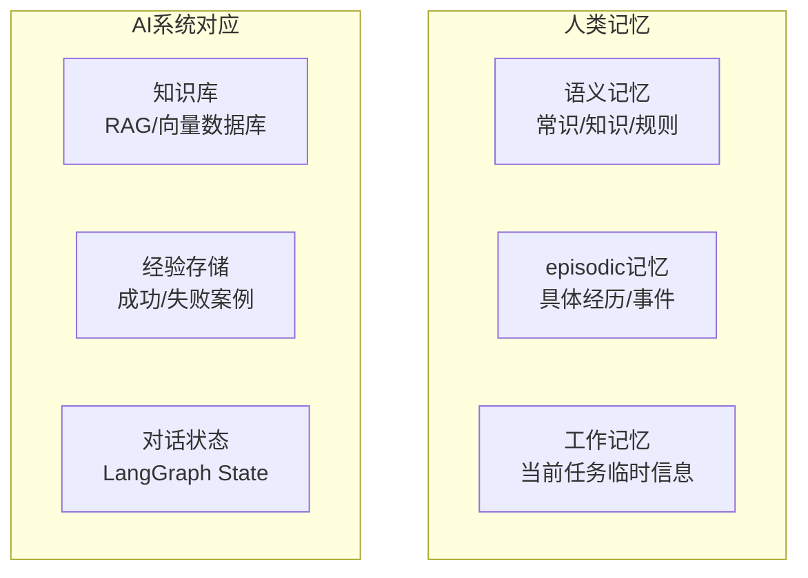
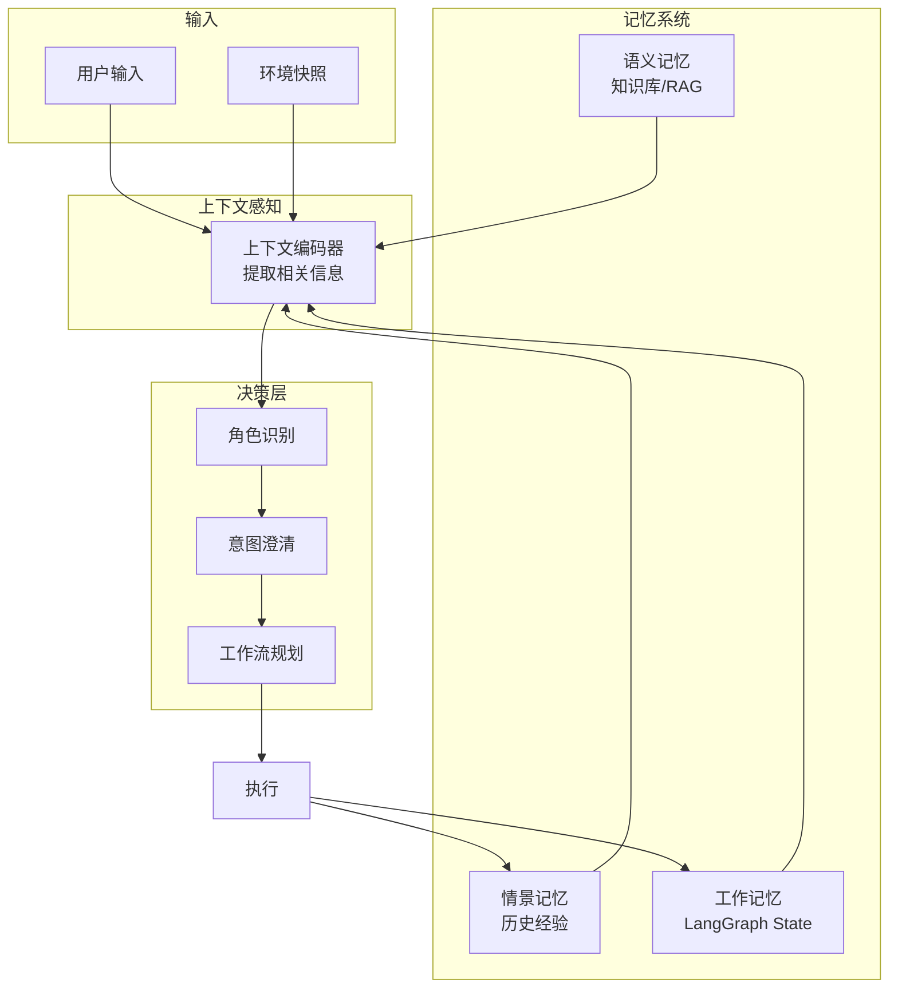
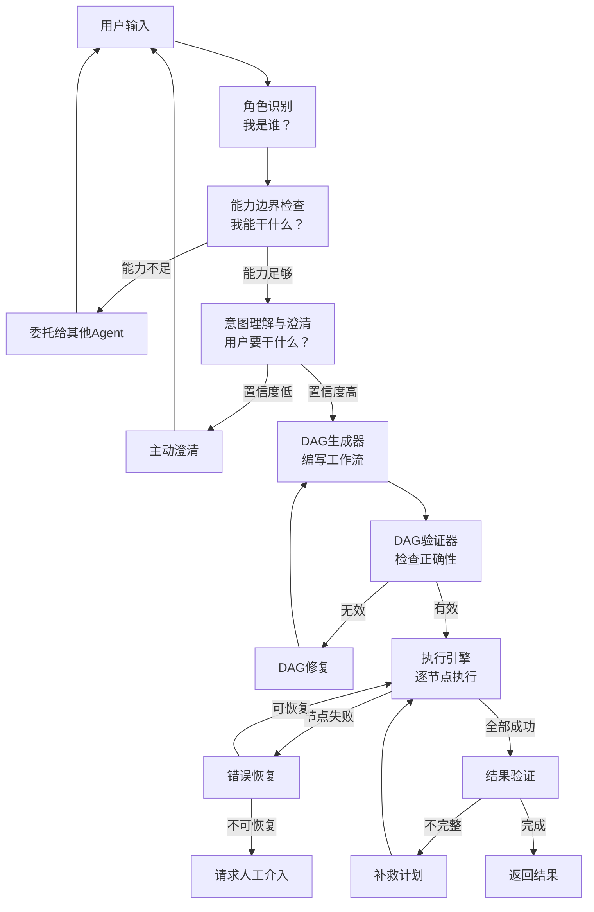
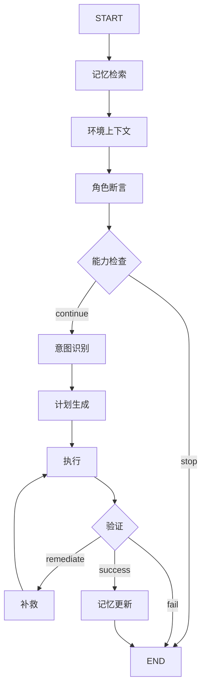

## 人类沟通的完整要素

```
当一个人要办一件事时，会无意识使用的要素：

1. 我是谁？        → 角色身份
2. 我能干什么？    → 能力边界
3. 用户要干什么？  → 意图目标
4. 我以前做过吗？  → 经验记忆
5. 现在什么情况？  → 环境上下文
6. 我该怎么做？    → 工作流规划
7. 做完了吗？      → 结果验证

```

## 记忆分层


**记忆和上下文不是可选项，而是必选项。** 没有记忆的系统每次都是"新手"，没有上下文的系统总是"眼盲"。
三层记忆体系
工作记忆（LangGraph State）：当前任务
情景记忆（数据库）：历史经验
语义记忆（知识库）：通用常识

## 完整的记忆和上下文件架构



## 架构图




| 维度      | 传统方案            | 你的思路               | 完整方案         |
| ------- | --------------- | ------------------ | ------------ |
| 角色      | 固定system prompt | 动态识别               | + 角色切换       |
| 能力      | 静态工具列表          | 能力边界               | + Subagent路由 |
| 意图      | 单次理解            | 结构化提取              | + 交互式澄清      |
| 规划      | 静态DAG           | 动态生成               | + DAG验证      |
| **记忆**  | **无**           | **显式区分语义/情景/工作记忆** | + 经验学习       |
| **上下文** | **无**           | **环境快照**           | + 动态适应       |
| 执行      | 线性执行            | 逐节点                | + 容错恢复       |
| 验证      | 无               | 完成确认               | + 闭环学习       |

## langgraph 执行DAG图  


## 情景记忆类型

| 维度        | daily_summary                             | topic_summary                            | key_fact                                        | preference                                                        |
| --------- | ----------------------------------------- | ---------------------------------------- | ----------------------------------------------- | ----------------------------------------------------------------- |
| **驱动维度**  | 时间                                        | 主题/项目                                    | 用户属性                                            | 用户偏好                                                              |
| **内容性质**  | 叙事性、事件性                                   | 系统性、完整性                                  | 事实性、确定性                                         | 主观性、指导性                                                           |
| **时效性**   | 短期（7-30天）                                 | 长期（项目周期）                                 | 长期（永久）                                          | 长期（永久）                                                            |
| **更新频率**  | 每天                                        | 按需（讨论新进展时）                               | 很少更新                                            | 偶尔更新                                                              |
| **注入优先级** | 中（近期上下文）                                  | 中（相关主题时）                                 | 高（用户画像）                                         | 最高（行为指导）                                                          |
| **淘汰策略**  | 自动过期                                      | 项目结束后归档                                  | 几乎不淘汰                                           | 几乎不淘汰                                                             |
| 定义        | 对用户某一天（或某一段连续对话）的**整体概括**，记录当天聊了什么、发生了什么。 | 按**话题/项目/领域**聚合的记忆，跨时间维度归纳用户在某个主题下的所有讨论。 | 用户表达的**确定性信息**，包括身份、职业、技能、关系、偏好设置等**静态或半静态属性**。 | 用户明确表达的**喜好、风格要求、操作习惯**，通常以"I prefer..."、"下次请..."、"我不喜欢..."等形式出现。 |
